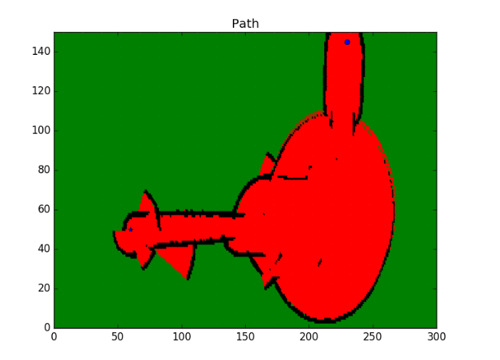
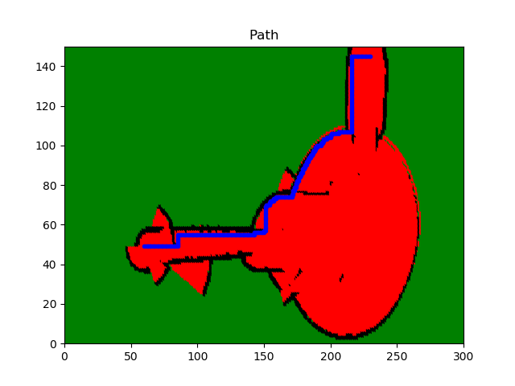

# Example Path Planning Implementation

In these examples, an breadth-first search and A* search have been applied to path plan a simple map. Additionally, the A* search implementation was also used to solve the path planning problem for a more complex, real-world map.

## Simple Map

In this problem, a robot is moving inside a 5x6 map from the start to the goal. The robot can move in four directions: up, down, left, and right. 

The 5x6 grid is shown below where 1's represent obstacles and 0's represent free space. The robot start position is (0,0) and the goal position is (4,5). Additionally, the cost of movement from one cell to another is 1.


This problem was solved using breadth-first search and A* search with solutions found in __breadth_first_search.cpp__ and __a_search.cpp__ source files, respectively.

## Real-World Map

For the second problem, the robot is now moving in a 300x150 map that is stored in __map.txt__ that stores the log odds value of each cell. The numbers are interpreted as follows:

* a cell is unknown if the log odds value is equal to 0
* a cell is occupied if the log odds value is larger than 0
* a cell is free if the log odds value is less than 0

The robot starts at position {230,145} and moves to the goal position {60,50}. Again, the cost of movement from one cell to another is 1. 

Run the following command to generate and visualize the map with the planned path:

```
$ g++ a_search_image.cpp -std=c++11 -I/usr/include/python2.7 -lpython2.7
$ ./a.out
```

The before and after figures are shown below for the map:

