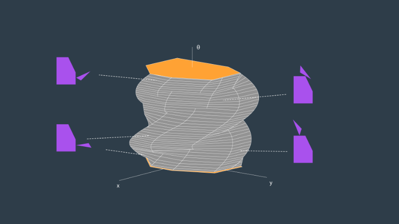

# Classic Path Planning - Discrete Planning

There are 3 main approaches to the path planning problem:

* Discrete Planning
* Sample-Based Planning
* Probabilistic Planning

In this module, the concept of discrete planning was reviewed including its key concepts. Discrete planning is the process of creating a discretized representation of the current environment and then using search algorithms to find the optimal path. Methods of space representation, discretization, and searching were looked at.

Discrete planning follows a sequence of 3 steps:

1. Continuous Represenation
2. Discretization
3. Graph Search

## Continuous Representation
The first step is to create an accurate representation of the map of the environment. Once this has been obtained, it is often modified to allow for simplifications in the future. 

To simplify the path planning process later, it is often easier at the start to assume the robot as a infinitesimally small object or dot that looks for the best path from the start to the end through any infinitesimally small separation between obstacles. However, in reality robots due have varying sizes and radiuses. As a result, as we decrease the radius of the robot to an infinitesimally small amount, we can increase the size of the obstacles by the same amount to in effect have the same continuous representation. The below figures demonstrate this:

To do this, the __Minowksi Sum__ is used to add the robot size to the perimeter of the obstacles. In example of this has been coded in the __minowski_sum.cpp__ source file. As seen below, the code will take the blue robot and the red obstacle as input to create a new, larger obstacle (green), that when shifted (yellow), creates a fattened obstacle to ensure that the robot (blue) will never collide with the original obstacle (red).

After the minowski sum has been applied to the map, we know have a suitable configuration space that has been reduced to the robot as an infinitesimally small object making the rest of the path planning process much easier.

### 3D Configuration Space
It should be noted that most robots don't have a perimeter the shape of a perfect circle. As a result, depending on the orientation of the robot when the Minowksi Sum is generated can produce varying results in the configuration space. If a new variable __theta__ is used to represent the robot orientation, the configuration spaces created at every angle can be computed and stacked on each other and will result in a helix shown below.

## Discretization
Now that the continuous configuration space has been formed, it needs to be descritized in order to be able to be traveresed by a search algorithm. 3 types of discretization will be looked at:

* Roadmap (Visibilty Graph and Voronoi Diagram)
* Cell Decomposition
* Gradient Field

### Roadmap
Roadmap represents the configuration space as a simple connected graph. There are 2 main methods for doing this. 

The __Visibility Graph__ builds the roadmap by connected all nodes within the configuration space. A node includes the start and goal nodes as well as all object vertices. The Visibility Graph provide the shortest path from the start to the end as a piecewise linear function. This Visibility Graph contains is completed and contains the most optimal path but the robot would traverse very closesly to obstacles in that case. An example is shown below of a Visibility Graph.

The __Voronoi Diagram__ generates a roadmap by maximizing the clearance between obstacles. All of the edges in the roadmap are equal distance from all surrounding obstacles. This method is complete and allows maximum clearance of the robot around obstacles but does not include the optimal path.

### Cell Decomposition
Cell decomposition divides the configuration space into cells (or nodes) that are connected by edges. This is done through 2 main methods.

__Exact Cell Decomposition__ divides the space into non-overlapping cells. Vertical lines are drawn in the configuration space at every obstacles vertex and cells (nodes) are formed in the shape of triangles and trapezoids. An example graph creation using this method is shown below. This method produces odd shapes for cells and is very precise but is also very resource intensive so it is typcially not implemented in reality.

__Approximate Cell Decomposition__ divides the configuration space into cells shaped as rectangles and sqaures. The algorithm starts by dividing the configuration space into 4 equal square cells, labelling cells as either free, mixed, or full. It then searches for a path of free cells from the start to the end. If nothing is found, it continous the process of dividing mixed cells into 4 equal cells, labelling them, and then determining if there is path to the goal. The process continues until a path is found.

### Potential Field
Instead of producing a graph, the Potential Field method generates two functions - one function that attracts the robot to the goal and the other that repels the robot from obstacles. By applying optimization such as gradient descent to the combination of these functions, the robot can find a path to the goal. A graphical representation is shown of the combination of the two functions below with obstacles as high peaks and the entire graph sloping from the start to the end. It can be seen from the resulting function, that if the robot were a ball that it would move toward goal while avoiding obstacles.

## Graph Search
Now that the continuous configuration space has been discretized by one of the above methods that produces a graph, a search algorithm is applied to the graph to find the optimal path. There are 4 types of search algorithms that will be reviewed:

* breadth-first search
* depth-first search
* uniform cost search
* A* search

### Breadth-First Search
The breadth-first search algorithm is a complete and optimal search algorithm that searches graphs broadly before deeply. The algorithm looks at a search tree one level at a time, looking at all children nodes of the previous level first before moving to the next level. The algorithm uses a queue data structure to store the nodes in the current frontier in order that the oldest nodes are explored first. The order of node search can be seen in the below figure.

Example code for a breadth-first search solution to a simple path planning problem can be found in examples.

### Depth-First Search
The depth-first search algorithm is not a complete or optimal search algorithm. It searches deeply in a graph before broadly. The algorithm will explore the intial node's first child, then that node's first child, and so on. The algorithm uses a stack data structure to store the nodes in the current frontier in order that the newest nodes added will be explored first. The order of node search can be seen in the below figure.

### Uniform Cost Search
Uniform cost search is similar to bread-first search, but differs in the fact that it can only be used on graphs that have edge costs. That way, uniform cost search explores nodes in order of increasing cost from the initial node. Uniform cost search is a complete and optimal search algorithm. The algorithm uses a queue to store the nodes in the frontier, similar to bread-first search, but uses a priority queue in order that the oldest nodes with the lowest cost are explored first.

### A* Search
All previous search algorithms discussed are uninformed search algorithms. A* search is an informed search algorithm which means it takes into account other information about the goal while doing its search. A* searches by minimizing the sum of path cost and a heuristic function that represents the distance to the goal (Euclidean, Manhattan). Therefore it favors path in the direction of the goal and paths that have low cost.

Example code for a A* search solution to a simple path planning problem can be found in examples.