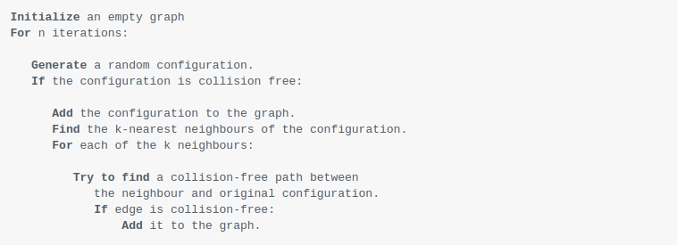
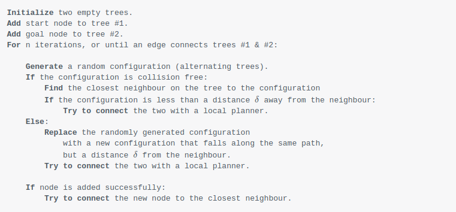

# Sample-Based Planning

As configuration spaces become more complex and more dimensional, it can be difficult to discretize such a large space. As a result, other techniques to discrete planning are used, like sample-based planning. Additionally, planning methods such as sample-based are used instead of basic discrete planning in cases of complex motion dynamics, where constraints are dependent on not just current values (ex/ turning radius of car changes with its speed).

Often with more complex systems, achieving the optimal path is unrealistic. As a result, requirements can be weakened to the point where search algorithms become probabilistically complete, meaning its probability of finding a path approaches 1 as time approaches infinity. Instead of the optimal path, more feasible paths are found.

Sample-based planning does not discretize the entire configuration space but samples it randomly to generate a graph of the environment faster but not as accurate. As time approaches infinity, the number of samples increase and the probability of finding a path approaches 1.

We will look at 2 approaches to sample-based planning:

1. Probabilistic Roadmap (PRM)
2. Rapidly Exploring Random Tree Method (RRT)

## Probabilistic Roadmap (PRM)

The PRM method takes random samples of the configuration space, determines if the space is free, and if so, will add the configuration to the resulting graph by attaching it to its k-nearest neighbors. This process repeats for fixed number of iterations. Then a graph search algorithm, like A*, is applied to the graph to find a path. The pseudocode for this algorithm is shown below.

Parameters such as iteration number, number of k-nearest neighbors, etc. can be tweaked according to certain applications or use cases. Another nice quality of PRM, is that it is an multi-query planner, meaning the computationally slow process of generating the graph can be used more than once by the graph search algorithm. This is useful in environments where the surrounding environment is not changing frequently.

## Rapidly Exploring Random Tree Method (RRT)

For environments where configurations are changing more frequently, RRT is a more effective methods of planning. RRT generates a tree, a special graph where child nodes are not connected to on another. In RRT, both the start and goal nodes begin generating trees, by randomly creating nodes in the configuration space and adding them to the closest node in the tree if they can be attached collision free. If there is a collision, the node will be replaced with one closer to to the nearest neighbour along the path to the nearest neighbour. This process is repeated until both trees can be attached. The pseudocode can be found below.

Parameters such as sampling method, max distance to nearest node, etc. can be tuned to fit the appropriate application. Since RRT starts exploring with both the goal and start nodes, it is a single-query planner, meaning the resulting graph can only used to solve for the path once. However, since RRT is generating a graph for the entire configuration space, it is much faster in generating graphs and should be used on robots in environments that are constantly changing.