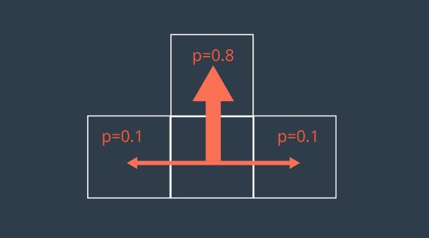
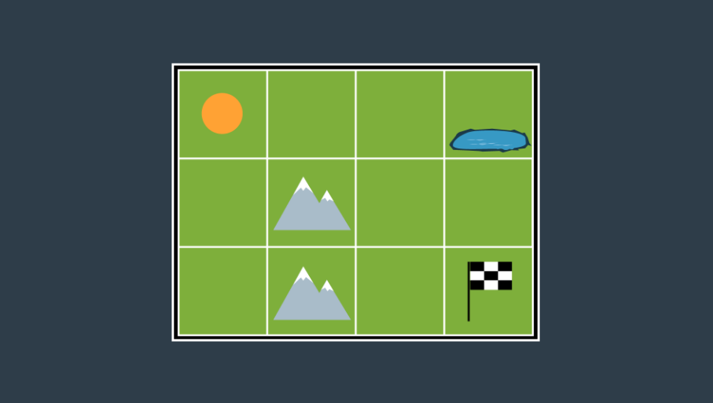
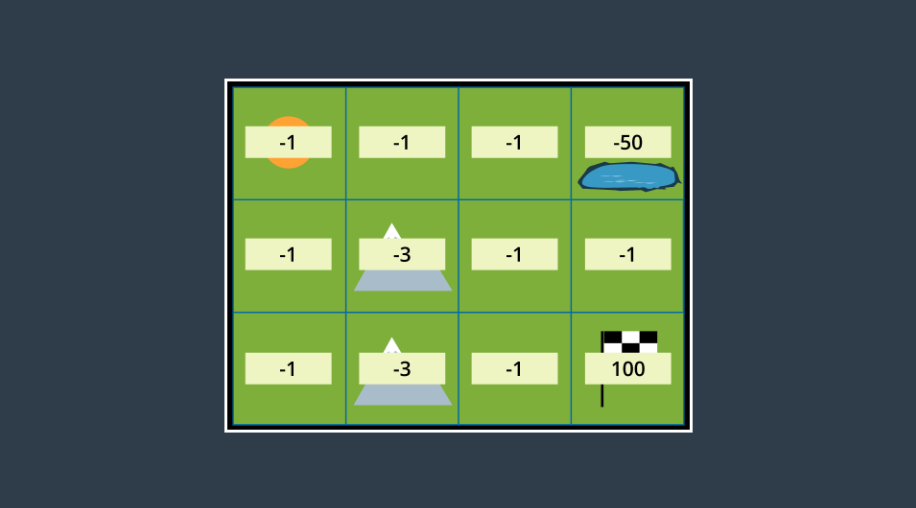
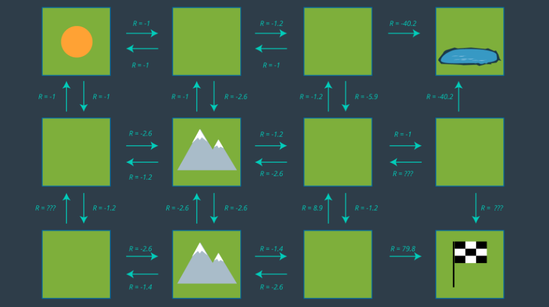
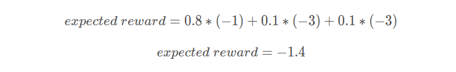
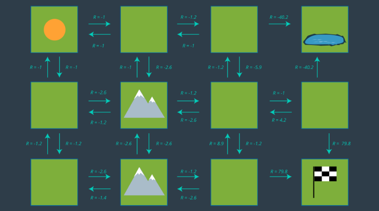
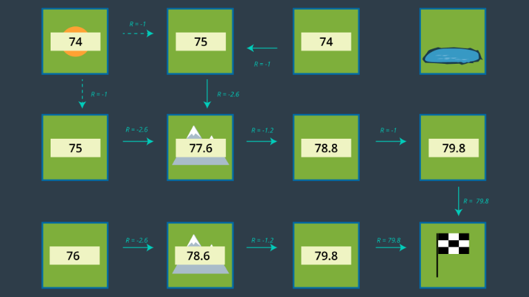
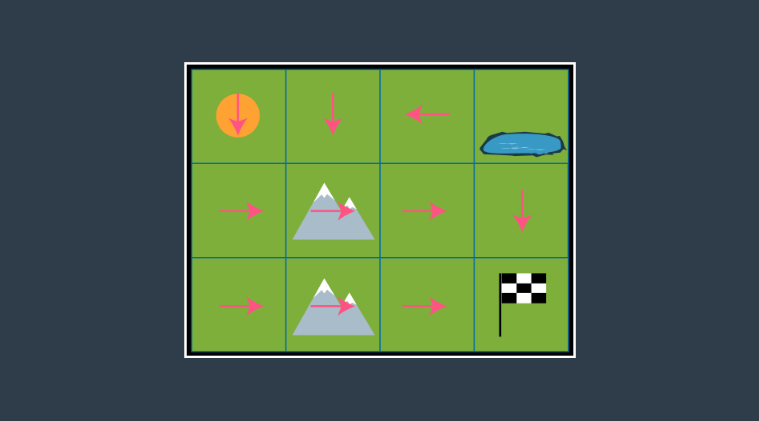

# Probabilistic Planning
Probabilistic planning is able to take into account the risk or difficulty levels of certain paths by assigning negative rewards to certain areas of the map. In simpler planning methods, like discrete planning, the most optimal path it finds may be a great risk to the robot due to its unpredictable motion. As a result, probabilistic planning can assign negative rewards where risk is high to allow the planned path to be less risky. Probabilistic planning also can take into account the uncertainty of the robot motion itself.

The __Markov Decision Process (MDP)__ provides the setup for modelling decision making for stochastic processes where results are uncertain and have probabilities less than 1. It is used for assigning states, rewards for those states, and transition models that present probabilities of moving to one state from another. Due to a variety of real-world effects, a mobile robot migh have a transition model as shown below:

Using MDP, we can assign rewards to separate states in an environment that correspond to risks, goals, and other hazards. In this case, the robot will receive a reward (positive or negative) for entering every state. Rewards are assigned as follows:

* states that are not goal states are assigned small negative values to represent cost of time passing
* goal states are assigned large positive rewards
* hazardous states are assigned large negative rewards

An example environment is shown here with and without state rewards assigned:

With the transition model and rewards defined, we now define actions that the robot can take from every state in the environment. 

Now a __policy__ can be chosen that maximizes the overall reward. A policy is just a mapping from states to actions and defines the action the robot should take from all states.

To determine the reward, we calculate expected reward because our model is non-deterministic. The transition model presented above is used to calculate the expected reward for moving right from the bottom mountain cell.

Now, the map is update with all of the expected rewards:

We now use __state utility__ to detemine the optimal policy for every state. State utiliy refers to the sum of the rewards that an agent would receive if it started at that state and moved to the goal. As a result, the optimal policy will choose actions and paths that maximize the utility of the state. Starting from the goal state having a state utiliy of 0, the state utility can be determined for all states using the rewards defined in the map above. Then the optimal policy or direction is defined for every state to maximize utility. The results are shown below:

This is a very simplified map, where calculations can be done intuitively. In more complex real-world problems and environments, the __Value Iteration Algorithm__ can be used to solve for state's utility using a random initialized value and an iterative process that produces a more accurate result with increased iterations.